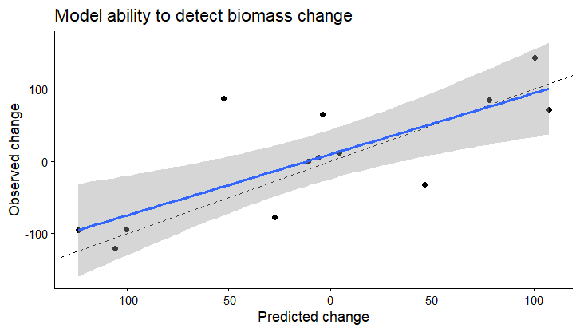
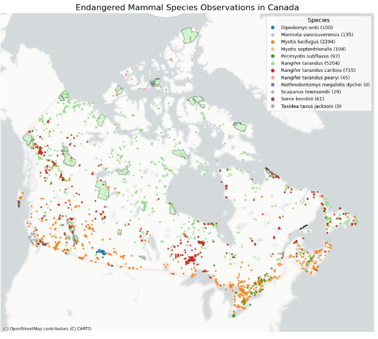
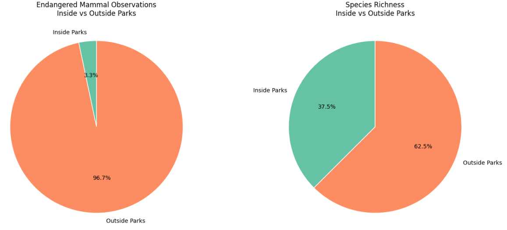
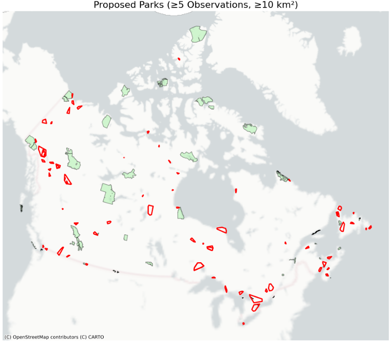
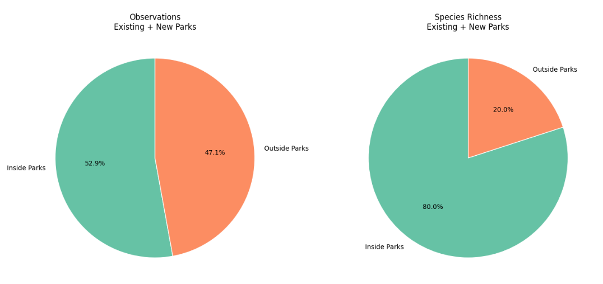

# Project 1 - Capstone Deliverables

These are deliverables of my MGEM capstone project. The project focus on land cover transition and biomass change in the Mudge and Link study areas using LiDAR and remote sensing data. The study integrates airborne LiDAR metrics, satellite imagery, and forest inventory data to model aboveground biomass and detect land-cover transitions between 2019 and 2024.

By combining machine learning methods with spatial analysis, the project evaluates forest disturbance, regeneration, and stable forest conditions across the landscape. The results provide insights into forest dynamics and demonstrate how remote sensing can support monitoring and management of forest ecosystems.

## Land Cover Transition

The following maps of smoothed land cover classification raster that exhibit land cover distribution over the study area

```{r setup, include=FALSE}
library(terra)
library(leaflet)

```

*2019:*

```{r map2019, echo=FALSE, warning=FALSE, message=FALSE}
rast2019 <- rast("data/classified_2019_smoothed.tif")

# class values and labels
vals2019 <- c(1,2,3,4,5)

labs2019 <- c(
  "Broadleaf Forest",
  "Coniferous Forest",
  "Non-forest vegetation",
  "Water",
  "Others"
)

cols2019 <- c("#A6D96A", "#33A02C", "#F1A026", "#2B83BA", "#DE3B13")

pal2019 <- colorFactor(cols2019, domain = vals2019)

leaflet() %>%
  addProviderTiles("Esri.WorldImagery") %>%
  addRasterImage(rast2019, colors = pal2019) %>%
  addLegend(
    position = "bottomright",
    colors = cols2019,
    labels = labs2019,
    title = "Land-cover classes",
    opacity = 1
  )
```

*2024:*

```{r map2024, echo=FALSE, warning=FALSE, message=FALSE}
rast2024 <- rast("data/classified_2024_smoothed.tif")

# class values and labels
vals2024 <- c(1,2,3,4,5)

labs2024 <- c(
  "Broadleaf Forest",
  "Coniferous Forest",
  "Non-forest vegetation",
  "Water",
  "Others"
)

cols2024 <- c("#A6D96A", "#33A02C", "#F1A026", "#2B83BA", "#DE3B13")

pal2024 <- colorFactor(cols2024, domain = vals2024)

leaflet() %>%
  addProviderTiles("Esri.WorldImagery") %>%
  addRasterImage(rast2024, colors = pal2024) %>%
  addLegend(
    position = "bottomright",
    colors = cols2024,
    labels = labs2024,
    title = "Land-cover classes",
    opacity = 1
  )
```

The transition map shows the transitions types of land cover between 2019 and 2024 over the Mudge Island and the Link Island.

```{r map——transition, echo=FALSE, warning=FALSE, message=FALSE}
rast_trans <- rast("data/transition_3type.tif")

vals_trans <- c(1, 2, 3, 4)

labs_trans <- c(
  "Stable Forest",
  "Regeneration",
  "Disturbance",
  "Others"
)

cols_trans <- c("#2ca02c", "#dce319", "#ff1a1a", "#9e9e9e")

pal_trans <- colorFactor(
  palette = cols_trans,
  domain = vals_trans,
  na.color = "transparent"
)

leaflet() %>%
  addProviderTiles("Esri.WorldImagery") %>%
  addRasterImage(rast_trans, colors = pal_trans) %>%
  addLegend(
    position = "bottomright",
    colors = cols_trans,
    labels = labs_trans,
    title = "Transition type",
    opacity = 1
  )
```

The following map shows lidar metrics that girded by 3\*3 pixel resolution to match study site extent:

```{r m, echo=FALSE, warning=FALSE, message=FALSE}
# load LiDAR metrics raster
r <- rast("data/lidar_gridmetrics_3m.tif")

# assign metric names
names(r) <- c(
  "zmin","zmax","zmean","zq20","zq50","zq90",
  "pzabove2","zsd","zskew","zkurt","crr","zcv"
)

# create map
m <- leaflet() %>%
  addProviderTiles("Esri.WorldImagery")

# add each metric as a switchable layer
for(i in 1:nlyr(r)) {

  metric <- r[[i]]
  metric_name <- names(r)[i]

  pal <- colorNumeric(
    palette = "viridis",
    domain = values(metric),
    na.color = "transparent"
  )

  m <- m %>%
    addRasterImage(
      metric,
      colors = pal,
      group = metric_name
    )
}

# layer control
m <- m %>%
  addLayersControl(
    baseGroups = names(r),
    options = layersControlOptions(collapsed = FALSE)
  )

m
```

The resulting biomass model prediction accuracy examining as following figure:

```{r model_accuracy, echo=FALSE, fig.cap="Observed vs. predicted biomass change showing the model's prediction accuracy.", out.width="90%"}


```

## Code Snippets

Sample code snippet. Notice that you can provide a toggle to switch between coding languages - this is referred to as a 'tabset' in quarto. It is good practice to try and convert your R code to python, and vice-versa to demonstrate coding proficiency. For example, let's showcase a function for calculating NDVI in R and Python.

::: {.panel-tabset group="language"}
## R

``` (.r)
# Read 2019 files
my_polygons <- vect("classification_data/island_boundary.shp")
ls_image_1 <- rast("output/classified_2019_smoothed.tif")
poly_path <- "biomass_training/2024/mudge_link_biomass_2024.shp"    # polygons with a 'set' field (train/val) + class/label

# Crop to bounding box, then mask to polygon
island_poly <- as.polygons(my_polygons)

classified_clip <- crop(ls_image_1, island_poly)
classified_clip_2019 <- mask(classified_clip, island_poly)

# ---- Define class names and colors ----
lc_levels <- c(
  "Broadleaf Forest",
  "Coniferous Forest",
  "Non-forest vegetation",
  "Water",
  "Others"
)

lc_cols <- c(
  "Broadleaf Forest"       = "#A6D96A",
  "Coniferous Forest"      = "#33A02C",
  "Non-forest vegetation"  = "#F1A026",
  "Water"                  = "#2B83BA",
  "Others"                 = "#DE3B13"
)

# ---- Convert classified raster to categorical with labels ----
cm <- as.factor(classified_clip_2019)
ids <- sort(na.omit(unique(values(cm))))  # 2 3 4 5

# If your raster values are 1..6 (most common):
levels(cm) <- data.frame(
  ID    = ids,
  class = lc_levels[ids]   # picks 2..5 from your label list
)

# ---- Assign colors in the correct order ----
cols_ordered <- unname(lc_cols[ levels(cm)[[1]]$class ])

# plot to see
plot(cm, col = cols_ordered, legend = TRUE)


# Read 2024 files
ls_image_2 <- rast("output/classified_2024_smoothed.tif")

# Crop to bounding box, then mask to polygon
classified_clip_2 <- crop(ls_image_2, island_poly)
classified_clip_2024 <- mask(classified_clip_2, island_poly)

# ---- Convert classified raster to categorical with labels ----
cm_2 <- as.factor(classified_clip_2024)
ids <- sort(na.omit(unique(values(cm_2))))  # 2 3 4 5

# If your raster values are 1..6 (most common):
levels(cm_2) <- data.frame(
  ID    = ids,
  class = lc_levels[ids]   # picks 2..5 from your label list
)

# ---- Assign colors in the correct order ----
cols_ordered <- unname(lc_cols[ levels(cm_2)[[1]]$class ])

# plot to see
plot(cm_2, col = cols_ordered, legend = TRUE)

# Save clipped classified map
writeRaster(classified_clip_2024,
            "output/classified_2024_boundary.tif",
            overwrite = TRUE)
# Save clipped classified map
writeRaster(classified_clip_2019,
            "output/classified_2019_boundary.tif",
            overwrite = TRUE)


# Markov Model Transition:
lc_2019 <- rast("output/classified_2019_boundary.tif")
lc_2024 <- rast("output/classified_2024_boundary.tif")
# stack
s <- c(lc_2019, lc_2024)
v <- values(s, mat = TRUE)     # force a matrix
v <- v[complete.cases(v), ]    # remove rows with NA in either year

# Transition counts (rows=from, cols=to)
trans_counts <- table(v[,1], v[,2])
trans_counts

## Plot the exact transition 
# convert counts to percentage by row
trans_percent <- prop.table(trans_counts, margin = 1) * 100

# convert to dataframe
df_percent <- as.data.frame(as.table(trans_percent))
colnames(df_percent) <- c("From", "To", "Percent")

# apply class labels
class_labels <- c(
  "1" = "Broadleaf Forest",
  "2" = "Coniferous Forest",
  "3" = "Non-forest vegetation",
  "4" = "Water",
  "5" = "Others"
)

df_percent <- df_percent %>%
  mutate(
    From = factor(class_labels[as.character(From)],
                  levels = class_labels),
    To   = factor(class_labels[as.character(To)],
                  levels = class_labels)
  )

# plot heatmap
ggplot(df_percent, aes(x = To, y = From, fill = Percent)) +
  geom_tile(color = "white") +
  geom_text(
    aes(label = sprintf("%.1f%%", Percent),
        color = Percent > 50),   # TRUE/FALSE condition
    size = 3
  ) +
  scale_color_manual(
    values = c("white", "black"),
    guide = "none"
  ) +
  theme_classic() +
  labs(
    title = "Land-cover transition percentage (2019–2024)",
    x = "To class",
    y = "From class",
    fill = "Percentage"
  ) +
  theme(
    axis.text.x = element_text(angle = 30, hjust = 1, face = "italic"),
    axis.text.y = element_text(face = "italic")
  )

# Transition probabilities (rows sum to 1)
trans_prob <- prop.table(trans_counts, margin = 1)
trans_prob

#Plot the transition probability result
df <- as.data.frame(as.table(trans_prob))
colnames(df) <- c("From", "To", "Prob")

# apply labels
df2 <- df %>%
  mutate(
    From = factor(class_labels[as.character(From)],
                  levels = class_labels),
    To   = factor(class_labels[as.character(To)],
                  levels = class_labels)
  )

# plot Markov transition probability heatmap
ggplot(df2, aes(x = To, y = From, fill = Prob)) +
  geom_tile(color = "white") +
  theme_classic() +
  labs(
    x = "To class",
    y = "From class",
    fill = "Transition probability",
    title = "Markov transition matrix (2019–2024)"
  ) +
  theme(
    axis.text.x = element_text(
      angle = 30,          # rotate
      hjust = 1,
      face = "italic",     # italic font
      size = 8
    ),
    axis.text.y = element_text(
      face = "italic",
      size = 8
    )
  )

# Plot in line
#define names:
get_props <- function(r, year){
  v <- na.omit(values(r))
  p <- prop.table(table(v))
  tibble(
    Year = year,
    Class = as.character(names(p)),   # ensure character
    Proportion = as.numeric(p)
  )
}

props <- bind_rows(
  get_props(lc_2019, 2019),
  get_props(lc_2024, 2024)
) %>%
  mutate(
    Class = class_labels[Class],   # direct lookup (most reliable)
    Class = factor(Class,
                   levels = c("Broadleaf Forest",
                              "Coniferous Forest",
                              "Non-forest vegetation",
                              "Water",
                              "Others"))
  )

ggplot(props, aes(x = Year, y = Proportion,
                  color = Class, group = Class)) +
  geom_line(linewidth = 0.5) +
  geom_point(size = 2) +
  theme_classic() +
  labs(
    title = "Land-cover Proportions Over Time",
    color = "Land-cover class"
  )


# Produce trasition types table .csv
# extract pixel values
s <- c(classified_clip_2019, classified_clip_2024)
names(s) <- c("lc2019", "lc2024")

df <- as.data.frame(s, xy = FALSE, na.rm = TRUE)
# create transition variables 
df$transition <- paste(df$lc2019, df$lc2024, sep = "_to_")

# build transition table
transition_table <- as.data.frame(table(df$transition))
colnames(transition_table) <- c("transition", "pixel_count")

# convert to area and propostion
pixel_area <- 3 * 3  # m2

transition_table$area_m2 <- transition_table$pixel_count * pixel_area
transition_table$area_ha <- transition_table$area_m2 / 10000
transition_table$proportion <- transition_table$pixel_count /
  sum(transition_table$pixel_count)

transition_table
# define transition types 
transition_summary <- transition_table %>%
  mutate(
    transition_group = case_when(
      transition %in% c("1_to_1", "1_to_2", "2_to_1", "2_to_2") ~ "Stable_forest",
      transition %in% c("3_to_1", "3_to_2", "5_to_1", "5_to_2") ~ "Regeneration",
      transition %in% c("1_to_3", "1_to_5", "2_to_3", "2_to_5") ~ "Disturbance",
      TRUE ~ "Other"
    )
  )
# aggregate to 3 types 
stratified_3type <- transition_summary %>%
  group_by(transition_group) %>%
  summarise(
    pixel_count = sum(pixel_count),
    area_ha = sum(area_ha),
    proportion = sum(proportion)
  )

stratified_3type

# save tables
write.csv(stratified_3type,
            "output/stratified_3type.csv")
write.csv(transition_table,
          "output/transition_table.csv")

# create landcover transition by stands
# Reproject stands to match landcover rasters
stands <- vect(poly_path) 
stands <- project(stands, crs(classified_clip_2019))

# create a pixel-level transition raster
# numeric transition code: from*1000 + to
trans_code <- lc_2019 * 1000 + lc_2024
names(trans_code) <- "trans_code"
# create empty raster
trans_group <- trans_code
values(trans_group) <- NA
# assign stable forest
stable_codes <- c(1001,1002,2001,2002)
trans_group[trans_code %in% stable_codes] <- 1
# Assign regeneration groups 
regen_codes <- c(3001,3002,5001,5002)
trans_group[trans_code %in% regen_codes] <- 2
# assign disturbance
dist_codes <- c(1003,1005,2003,2005)
trans_group[trans_code %in% dist_codes] <- 3
# assign others 
trans_group[is.na(trans_group)] <- 4
# Make It Categorical
trans_group <- as.factor(trans_group)

levels(trans_group) <- data.frame(
  ID = 1:4,
  class = c("Stable_forest",
            "Regeneration",
            "Disturbance",
            "Other")
)
# make sure values are integers 1–4
trans_group_int <- classify(trans_group,
                            rbind(
                              c(1,1,1),
                              c(2,2,2),
                              c(3,3,3),
                              c(4,4,4)
                            ))
# crop then mask by island polygon
trans_crop <- crop(trans_group_int, island_poly)
trans_mask <- mask(trans_crop, island_poly)


# save 
writeRaster(trans_mask,
            "output/transition_3type.tif",
            datatype = "INT1U",
            overwrite=TRUE)

# --- Extract pixel transitions by stand ---
ex <- terra::extract(trans_code, stands)   # ID = polygon row index
ex <- ex %>% filter(!is.na(trans_code))

ex <- ex %>%
  mutate(
    from = trans_code %/% 1000,
    to   = trans_code %% 1000,
    transition = paste0(from, "_to_", to),
    transition_group = case_when(
      transition %in% c("1_to_1", "1_to_2", "2_to_1", "2_to_2") ~ "Stable_forest",
      transition %in% c("3_to_1", "3_to_2", "5_to_1", "5_to_2") ~ "Regeneration",
      transition %in% c("1_to_3", "1_to_5", "2_to_3", "2_to_5") ~ "Disturbance",
      TRUE ~ "Other"
    )
  )

# --- Dominant transition group + proportion per stand ---
stand_dom <- ex %>%
  count(ID, transition_group, name = "n_pix") %>%
  group_by(ID) %>%
  mutate(prop = n_pix / sum(n_pix)) %>%
  arrange(ID, desc(prop)) %>%
  slice(1) %>%
  ungroup()

# attach to stands (ID is polygon row index from terra::extract)
stands$dom_group <- NA_character_
stands$dom_group[stand_dom$ID] <- stand_dom$transition_group

stands$dom_prop <- NA_real_
stands$dom_prop[stand_dom$ID] <- stand_dom$prop

# --- Map group -> integer code (categorical raster) ---
group_code <- c(Stable_forest=1, Regeneration=2, Disturbance=3, Other=4)
stands$dom_code <- group_code[stands$dom_group]

# --- Create Stable_forest dominance proportion field (continuous) ---
# only Stable_forest gets dom_prop, others are NA
stands$stable_prop <- NA_real_
is_stable <- stands$dom_group == "Stable_forest"
stands$stable_prop[is_stable] <- stands$dom_prop[is_stable]   # 0–1

# --- Rasterize to the same grid as lc_2019 ---
dom_group_r <- rasterize(stands, lc_2019, field = "dom_code")
names(dom_group_r) <- "dom_code"

stable_prop_r <- rasterize(stands, lc_2019, field = "stable_prop")
names(stable_prop_r) <- "stable_prop"

# --- Save outputs ---
writeRaster(dom_group_r,  "output/stand_dom_group.tif", overwrite = TRUE, datatype="INT1U")
writeRaster(stable_prop_r,"output/stable_forest_dom_prop.tif", overwrite = TRUE)
```

## Python

``` (.python)
Not Yet Convert
```
:::

# Project 2 - Investigating Species at Risk Observations Within Canadian National Parks

Parks Canada has approached our consulting team to assess the occurrence of SAR within Canada’s National Parks. The goal is to better understand the conservation value of existing parks and identify species that may not be adequately represented within current protected area boundaries.

To conduct this analysis, Parks Canada has requested the use of the Global Biodiversity Information Facility (GBIF), a comprehensive biodiversity database that integrates records from citizen science platforms, research datasets, museum collections, and other sources.

To map endangered mammal occurrences outside national parks and generate evidence-based suggestions for new protected areas.

## Python Code

following section is sampled python code to extract endangered species from the dataset:

``` (.python)
# load and filter sar data
sar_df = pd.read_csv("CAN-SAR_database.csv")

# keep only endangered terrestrial mammals
filtered_sar = sar_df[
    (sar_df["taxonomic_group"] == "Mammals (terrestrial)") &
    (sar_df["sara_status"] == "Endangered")
]

# check results
print(f"number of endangered terrestrial mammals: {filtered_sar.shape[0]}")
print(filtered_sar[["species", "common_name"]].head())

# extract scientific names
species_list = filtered_sar["species"].dropna().unique().tolist()
print("\nspecies list:", species_list)


# download gbif occurrences for all target species

all_results = []

for sp in species_list:
    print(f"\ndownloading occurrences for: {sp}")
    offset = 0
    species_results = []
    while True:
        out = occurrences.search(
            scientificName=sp,
            country="CA",
            hasCoordinate=True,
            hasGeospatialIssue=False,
            offset=offset
        )
        if len(out["results"]) == 0:
            break
        species_results.extend(out["results"])
        offset += len(out["results"])
        print(f"    {len(species_results)} records downloaded so far...")
    # store species name
    for r in species_results:
        r["species"] = sp
    all_results.extend(species_results)
print(f"\ntotal gbif records downloaded: {len(all_results)}")

# convert to geo-dataframe

lat = [r["decimalLatitude"] for r in all_results]
lon = [r["decimalLongitude"] for r in all_results]
names = [r["species"] for r in all_results]

occ_gdf = gpd.GeoDataFrame(
    {"species": names},
    geometry=gpd.points_from_xy(lon, lat),
    crs="EPSG:4326"
)

# add taxonomic group and status

species_to_group = dict(zip(filtered_sar["species"], filtered_sar["taxonomic_group"]))
species_to_status = dict(zip(filtered_sar["species"], filtered_sar["sara_status"]))

occ_gdf["taxonomic_group"] = occ_gdf["species"].map(species_to_group)
occ_gdf["sara_status"] = occ_gdf["species"].map(species_to_status)

# load park polygons & match crs

parks_gdf = gpd.read_file("parks.gpkg")
occ_gdf = occ_gdf.to_crs(parks_gdf.crs)


# divide occurrences into species groups

species_groups = occ_gdf.groupby("species")

# convert to dictionary
species_dict = {sp: group for sp, group in species_groups}

print("species groups found:")
for sp in species_dict:
    print(f"{sp}: {len(species_dict[sp])} points")

# create color map for each species

import matplotlib.cm as cm
import matplotlib.colors as mcolors
import numpy as np

unique_species = list(species_dict.keys())
num_species = len(unique_species)

# use a colormap
cmap = cm.get_cmap('tab20', num_species)

species_color_map = {
    species: mcolors.to_hex(cmap(i))
    for i, species in enumerate(unique_species)
}

species_color_map

# function to plot species with unique colors

species_list = [
    "Dipodomys ordii",
    "Marmota vancouverensis",
    "Myotis lucifugus",
    "Myotis septentrionalis",
    "Perimyotis subflavus",
    "Rangifer tarandus",
    "Rangifer tarandus caribou",
    "Rangifer tarandus pearyi",
    "Reithrodontomys megalotis dychei",
    "Scapanus townsendii",
    "Sorex bendirii",
    "Taxidea taxus jacksoni"
]

species_color_map = { sp: plt.cm.tab20(i/20) for i, sp in enumerate(species_list) }


def plot_species_by_group_all(occ_gdf, parks_gdf, species_colors):
    fig, ax = plt.subplots(figsize=(13, 13))

    # plot parks
    parks_gdf.plot(ax=ax, facecolor="lightgreen", edgecolor="black", alpha=0.4)

    # build legend entries
    handles = []

    for sp, color in species_colors.items():
        subset = occ_gdf[occ_gdf["species"] == sp]

        # plot points if they exist
        if len(subset) > 0:
            subset.plot(
                ax=ax,
                color=color,
                markersize=5
            )

        # create legend marker
        handles.append(
            plt.Line2D(
                [0], [0],
                marker="o",
                color="w",
                markerfacecolor=color,
                markersize=8,
                label=f"{sp} ({len(subset)})"
            )
        )

    # add basemap
    cx.add_basemap(ax, crs=parks_gdf.crs, source=cx.providers.CartoDB.PositronNoLabels)

    # styling
    ax.set_title("Endangered Mammal Species Observations in Canada", fontsize=16)
    legend = ax.legend(
        handles=handles,
        title="Species",
        fontsize=9,
        title_fontsize=11,
        loc="upper right"
    )
    ax.set_axis_off()
    plt.show()
```

The following images shows the results:

```{r endagered_species, echo=FALSE, fig.cap="Observed endangered mammal species in Canada", out.width="90%"}


```

```{r species_richness, echo=FALSE, fig.cap="Comparison between endangered mammal sepceis inside parks and outside parks", out.width="90%"}

```

```{r proposed_parks, echo=FALSE, fig.cap="Proposed national parks that capture endangered mammal species clusters in a 10 km buffer", out.width="90%"}

```

```{r stats_new, echo=FALSE, fig.cap="Statistics of observations of existing parks and new-proposed parks", out.width="90%"}

```
